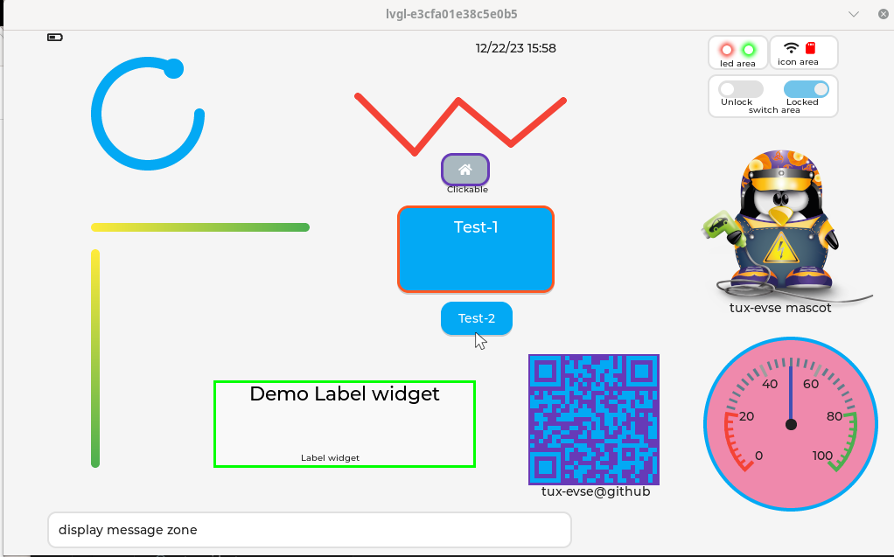

# lvgl-rclib-rs

Provides a RUST api to lvgl/C lib. It supports frame-buffer for embedded devices and GTK emulation
for desktop development.

Reference: https://docs.lvgl.io/8/widgets/index.html

## Building dependencies

* lvgl-lib+lvgl-driver: git@github.com:tux-evse/lv-evse-hmi-lib.git
* gtk-emulator: gtk3-devel and all it dependencies.
_For rebuilding lvgl library+driver check README at https://github.com/tux-evse/lv-evse-hmi-lib_

### Compiling for frame-buffer

Default driver is frame-buffer, it is typically what is used for embedded devices.

* Check FBDEV driver is enabled
* Check EVDEV_NAME=/dev/input/??? is pointing on your mouse/touch-screen
* Default RUST driver is 'FBDEV' EVDEV_NAME=/dev/input/lvgl should be changed or link to the right input device.

```
nm /usr/local/lib64/liblv_drivers.so | grep fbdev_init
cargo build
```

### Compiling with GTK emulator

For development and especially for business logic debug with vscode/llgb-gdb, it is far simpler to use GTK than FBDEV.

* Check GTK driver is enabled
* Check GTK screen emulator is compile with the right size ```cmake -DUSE_GTK=1 -DX_RES=1024 Y_RES=600 ..```
* Select GTK by setting ```USE_GTK=1``` environnement variable

```
nm /usr/local/lib64/liblv_drivers.so | grep gtk_init
USE_GTK=1 cargo build
```


WARNING: if despite of GTK=1 you still get an error as ```cglue::evdev_init(); not found``` then either:
* your lv_driver lib was not compiled with GTK
* you need to touch build.rs to force _capi-map.rs reconstruction

## Testing widget demo panel

```
cargo test --package lvgl --lib -- test::test_pannel
```


## Rust widget API

Check test-widget.ts for more widget and https://github.com/tux-evse/lvgl-binding-rs for a full example
with a integration within lib-afb micro service framework.

Create a label
```Rust
LvglLabel::new("Label-1", "Tux EvSe UI", 50, 400)
            .set_info("Demo Label widget")
            .set_size(300, 100)
            .set_color(LvglColor::rvb(0, 0, 0))
            .set_background(LvglColor::rvb(0xFF, 0xFF, 0xFF))
            .set_border(3, LvglColor::rvb(0, 0xff, 0))
            .finalize();
```

Create a button
```Rust
LvglButton::new("Button-A", "Test-1", 100, 200)
    .set_info("Demo Button 1")
    .set_size(180, 100)
    .finalize();
```

## Using frame-buffer without root privileges

1) In order to test without admin privileges, you need access to

* /dev/fb0 generally with 'video' group
* /dev/input0 usually with 'input' group

2) find which virtual console hold /dev/fb0 framebuffer

* switch virtual console with (Alt+Ctrl+F1) (Alt+Ctrl+F2) ...
* after login check with cat /dev/urandom >/dev/fb0

If your screen is repainted, then you are on /dev/fb0 other wise switch to next virtual console.


## Extract a frame-buffer screen cast

Copy framebuffer and transform it yo PNG. If needed crop image to content with gimp.
```
cp /dev/fb0 > /tmp/screen.data
RESOLUTION="1920x1080"
ffmpeg -vcodec rawvideo -f rawvideo -pix_fmt rgb32 -s $RESOLUTION -i /tmp/screen.data -f image2 -vcodec png screenshot.png
```
